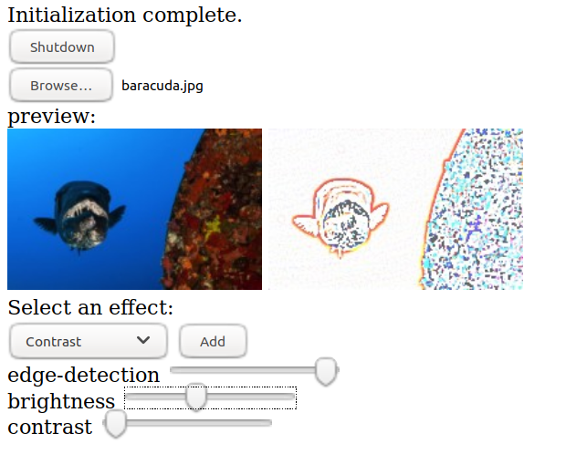

# wasmbild

wasmBild is an image transformation web UI based on the
[Bild](https://github.com/anthonynsimon/bild).

The idea and some of the code have been extracted from
[shimmer](https://github.com/agnivade/shimmer)

### Setup

- Continuous compilation on change `reflex -s -g "*.go" -- sh -c 'echo "compiling" && GOOS=js GOARCH=wasm ~/gowasm/bin/go build -o main.wasm .'`
- Serve the files using any HTTP server. (Note that .wasm files need to be served with `application/wasm` mime type. So the server must be capable of doing that.)
